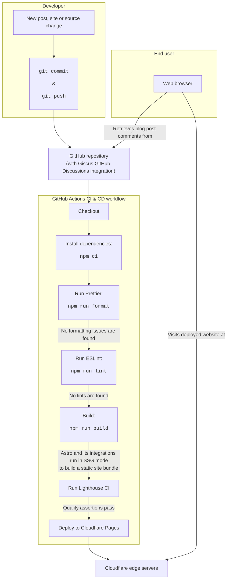

<div align="center">
<h1>🌐 Alejandro's personal space</h1>

<a href="https://astro.build"></a>

<a href="https://github.com/AlexTMjugador/Home/actions/workflows/ci.yml"></a>

<i>My own space on the web, featuring blog posts and personal highlights.</i>

</div>

This repository contains the source code for my personal website. Its design
follows the [Jamstack architecture](https://jamstack.org/), which can be easily
deployed to any web server requiring next to no server configuration.

At the heart of this architecture is [Astro](https://astro.build), a modern,
component-based static site generator built with extensibility and performance
in mind: Astro does not send any runtime JavaScript to web browsers by default,
and runs entirely at build-time.

Each commit triggers a continuous integration and deployment process powered by
GitHub Actions workflows, which statically analyzes the source, builds the site,
runs [Lighthouse CI](https://github.com/GoogleChrome/lighthouse-ci) on it, and
deploys the result to [Cloudflare Pages](https://pages.cloudflare.com/) edge
servers.

[Giscus](https://giscus.app/en/) is used as a database-less comments system
backed up by the GitHub Discussions of this repository.



# ✨ Highlights

- Automatic [RSS feed](https://en.wikipedia.org/wiki/RSS) generation on build
  time, allowing people and computers to consume blog posts from news reader
  applications.
- Written entirely in TypeScript, improving developer experience and code
  safety.
- Strict CI workflow to ensure code quality and end-user website performance,
  using Prettier, ESLint with additional accessibility lints, and Lighthouse
  CI.
- Follows good SEO practices: automatically generates a `robots.txt` file,
  sitemap and web manifest. Each page contains `<meta>` tags that describe it
  in a machine-parsable way.
- Observes the [Open Graph](https://ogp.me/) protocol, which enables beautiful
  link previews with custom images.
- Each blog post is associated an Open Graph image that is procedurally
  generated from its title and description.
- Images may be encoded in multiple formats and resized to fit different client
  viewport sizes, minimizing the bandwidth required to display them while allowing
  fallbacks to less efficient arrangements.
- Critical CSS styles are automatically inlined for better loading times with
  [Critters](https://github.com/GoogleChromeLabs/critters).
- Custom, refreshing analogous color scheme that defies the usual light-dark
  dichotomy, implemented with [Tailwind CSS](https://tailwindcss.com/).
- Client-side blog post search powered by [Pagefind](https://pagefind.app/).

# 📥 Getting started

The development workflow should be unsurprising to anyone acquaintanced with the
`npm` ecosystem. After cloning the repository, run the following commands to get
this website up and running in a local development server:

```
npm install
npm run dev
```

I recommend using editors like Visual Studio Code for modifying the source
because they provide a better experience: this repository contains settings
files for VS Code that will prompt you to set it up as intended. However, you
are free to use any other editor you like.

After making some changes you can run `npm run format:fix` and `npm run
lint:fix` to correct formatting and static analysis lints, respectively. When
ready, you can also execute `npm run build` to generate a production site bundle
at the `dist` directory.

## 📁 Project structure

This project distributes its source artifacts across folders as follows:

```
/
├── public
│   ├── giscus: styles for the Giscus widget used for post comments.
│   └── rss: XSLT stylesheet to beautifully display the site RSS feed on user agents with no RSS feed functionality.
└── src
    ├── components: miscellaneous components used in the site pages.
    ├── content
    │   └── blog: blog posts, in Markdown (.md) or MDX (.mdx).
    ├── images
    │   └── landscape-parallax: images for the animated landscape parallax component.
    ├── layouts: the layouts used for the generated pages.
    └── pages
        ├── blog
        │   └── post: route for rendering blog posts.
        ├── rss: page to generate the site blog posts RSS feed.
        └── thumbs: page to procedurally generated Open Graph thumbnail images for each blog post.
```

## ⚖️ License

[GPLv3](https://www.gnu.org/licenses/gpl-3.0.html) © Alejandro González
